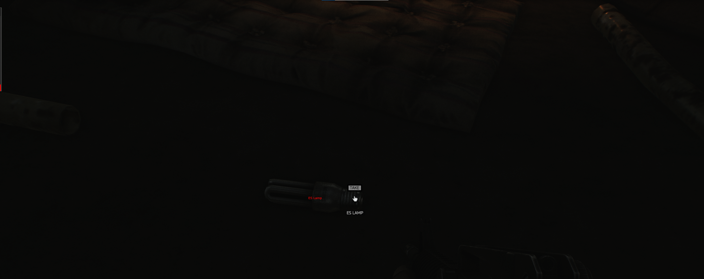

# GameBarUnityImplementation
Sister Application to [GameBarGUI](https://github.com/IntelSDM/GameBarGUI). 
Refer to documentation from [GameBarGUI Instructions](https://github.com/IntelSDM/GameBarGUI/blob/master/Instructions.md).  
 
This is a unity implementation of GameBarGUI to allow you to draw real-time information to the Xbox GameBar. This works by taking our unity module and then creating a WebSocket server, waiting for the connection to the GameBar to be established. Once the connection is established the gamebar instance will run a thread receiving information, and mutex lock it. Then we can process it in the drawing thread(for thread-safe data communication). 
We use [JSON.hpp](https://github.com/nlohmann/json) in the overlay and [Newtonsoft.JSON](https://github.com/JamesNK/Newtonsoft.Json) in the client. This allows us to read the information in a formatted way that we can understand on both client and server. We also use this to separate the data through a "type" name to be able to identify data to process different data all at once.  
This system can easily be modified to work with [pipes](https://learn.microsoft.com/en-us/windows/win32/ipc/pipes) but currently, it uses WebSockets for the ability to send an unlimited size of data quickly without predetermined data size requirements over a localhost network.  

## Images

  

  

  

